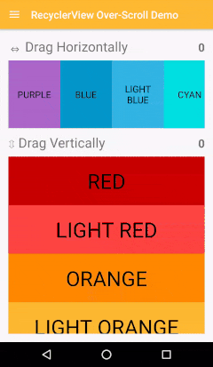

# Over-Scroll Support For Android's RecyclerView, ListView, GridView, ScrollView ...
 
The library provides an iOS-like over-scrolling effect applicable over almost all Android native scrollable views. It is also built to allow for very easy adaptation to support custom views.

The core effect classes are loose-[decorators](https://en.wikipedia.org/wiki/Decorator_pattern) of Android views, and are thus decoupled from the actual view classes' implementations. That allows developers to apply the effect over views while keeping them as untampered 'black-boxes'. Namely, it allows for keeping important optimizations such as view-recycling intact.



# Gradle Dependency

Add the following to your module's `build.gradle` file:

```groovy
dependencies {
    // ...
    
    compile 'me.everything:overscroll-decor-android:1.0.2'
}
```

# Usage

### RecyclerView

Supports both linear and staggered-grid layout managers (i.e. all native Android layouts).
Can be easily adapted to support custom layout managers.

```java
RecyclerView recyclerView = (RecyclerView) findViewById(R.id.recycler_view);
    
// Horizontal
OverScrollDecoratorHelper.setUpOverScroll(recyclerView, OverScrollDecoratorHelper.ORIENTATION_HORIZONTAL);
// Vertical
OverScrollDecoratorHelper.setUpOverScroll(recyclerView, OverScrollDecoratorHelper.ORIENTATION_VERTICAL);
```

### RecyclerView with items swiping / dragging
See _Advanced Usage_.


### ListView

```java
ListView listView = (ListView) findViewById(R.id.list_view);
OverScrollDecoratorHelper.setUpOverScroll(listView);
```

### GridView

```java
GridView gridView = (GridView) findViewById(R.id.grid_view);
OverScrollDecoratorHelper.setUpOverScroll(gridView);
```

### ScrollView, HorizontalScrollView

```java
ScrollView scrollView = (ScrollView) findViewById(R.id.scroll_view);
OverScrollDecoratorHelper.setUpOverScroll(scrollView);
    
HorizontalScrollView horizontalScrollView = (HorizontalScrollView) findViewById(R.id.horizontal_scroll_view);
OverScrollDecoratorHelper.setUpOverScroll(horizontalScrollView);
```

### Any View - Text, Image... (Always Over-Scroll Ready)

```java
View view = findViewById(R.id.demo_view);
    
// Horizontal
OverScrollDecoratorHelper.setUpStaticOverScroll(view, OverScrollDecoratorHelper.ORIENTATION_HORIZONTAL);
// Vertical
OverScrollDecoratorHelper.setUpStaticOverScroll(view, OverScrollDecoratorHelper.ORIENTATION_VERTICAL);
```

# Advanced Usage

```java
// Horizontal RecyclerView
RecyclerView recyclerView = (RecyclerView) findViewById(R.id.recycler_view);
new HorizontalOverScrollBounceEffectDecorator(new RecyclerViewOverScrollDecorAdapter(recyclerView));

// ListView (vertical)
ListView listView = (ListView) findViewById(R.id.list_view);
new VerticalOverScrollBounceEffectDecorator(new AbsListViewOverScrollDecorAdapter(listView));

// GridView (vertical)
GridView gridView = (GridView) findViewById(R.id.grid_view);
new VerticalOverScrollBounceEffectDecorator(new AbsListViewOverScrollDecorAdapter(gridView));

// A simple TextView - horizontal
View textView = findViewById(R.id.title);
new HorizontalOverScrollBounceEffectDecorator(new StaticOverScrollDecorAdapter(view));
```

### RecyclerView with [ItemTouchHelper](http://developer.android.com/reference/android/support/v7/widget/helper/ItemTouchHelper.html) based swiping / dragging
As of version 1.0.1, the effect can work smoothly with the RecyclerView's built-in mechanism for items swiping and dragging (based on [ItemTouchHelper](http://developer.android.com/reference/android/support/v7/widget/helper/ItemTouchHelper.html)). BUT, it requires some (very little) explicit configuration work:

```java
// Normally you would attach an ItemTouchHelper & a callback to a RecyclerView, this way:
RecyclerView recyclerView = (RecyclerView) findViewById(R.id.recycler_view);
ItemTouchHelper.Callback myCallback = new ItemTouchHelper.Callback() {
	...
};
ItemTouchHelper myHelper = new ItemTouchHelper(myCallback);
myHelper.attachToRecyclerView(recyclerView);

// INSTEAD of attaching the helper yourself, simply use the dedicated adapter c'tor, e.g.:
new VerticalOverScrollBounceEffectDecorator(new RecyclerViewOverScrollDecorAdapter(recyclerView, myCallback));

```

For more info on the swiping / dragging mechanism, try [this useful tutorial](https://medium.com/@ipaulpro/drag-and-swipe-with-recyclerview-b9456d2b1aaf).

### Over-Scroll Listeners
As of version 1.0.2, the effect provides a means for registering listeners of over-scroll related events. There are two types of listeners, as follows.

#### State-Change Listener
The over-scroll manager dispatches events onto a state-change listener denoting transitions in the effect's state:

```java

// Note: over-scroll is set-up using the helper method.
IOverScrollDecor decor = OverScrollDecoratorHelper.setUpOverScroll(recyclerView, OverScrollDecoratorHelper.ORIENTATION_HORIZONTAL);

decor.setOverScrollStateListener(new IOverScrollStateListener() {
    @Override
	public void onOverScrollStateChange(IOverScrollDecor decor, int oldState, int newState) {
	    switch (newState) {
	        case STATE_IDLE:
	            // No over-scroll is in effect.
	            break;
	        case STATE_DRAG_START_SIDE:
	            // Dragging started at the left-end.
	            break;
	        case STATE_DRAG_END_SIDE:
	            // Dragging started at the right-end.
	            break;
	        case STATE_BOUNCE_BACK:
	            if (oldState == STATE_DRAG_START_SIDE) {
	                // Dragging stopped -- view is starting to bounce back from the *left-end* onto natural position.
	            } else { // i.e. (oldState == STATE_DRAG_END_SIDE)
	                // View is starting to bounce back from the *right-end*.
	            }
	            break;
	    }
	}
}
```

#### Real-time Updates Listener
The over-scroll manager can also dispatch *real-time*, as-it-happens over-scroll events denoting the current offset resulting due to an over-scroll being in-effect (the offset thus denotes the current 'intensity').

```java
// Note: over-scroll is set-up by explicity instantiating a decorator rather than using the helper; The two methods can be used interchangeably for registering listeners.
VerticalOverScrollBounceEffectDecorator decor = new VerticalOverScrollBounceEffectDecorator(new RecyclerViewOverScrollDecorAdapter(recyclerView, itemTouchHelperCallback));

decor.setOverScrollUpdateListener(new IOverScrollUpdateListener() {
    @Override
    public void onOverScrollUpdate(IOverScrollDecor decor, int state, float offset) {
    	final View view = decor.getView();
    	if (offset > 0) {
    		// 'view' is currently being over-scrolled from the top.
    	} else if (offset < 0) {
    		// 'view' is currently being over-scrolled from the bottom.
    	} else {
    		// No over-scroll is in-effect.
    		// This is synonymous with having (state == STATE_IDLE).
    	}
    }
});

```


The two type of listeners can be used either separately or in conjunction, depending on your needs. Refer to the demo project's RecyclerView-demo section for actual concrete usage.
    
### Custom Views

```java
public class CustomView extends View {
    // ...
}
    
final CustomView view = (CustomView) findViewById(R.id.custom_view);
new VerticalOverScrollBounceEffectDecorator(new IOverScrollDecoratorAdapter() {

    @Override
    public View getView() {
        return view;
    }

    @Override
    public boolean isInAbsoluteStart() {
	    // canScrollUp() is an example of a method you must implement
        return !view.canScrollUp();
    }

    @Override
    public boolean isInAbsoluteEnd() {
	     // canScrollDown() is an example of a method you must implement
        return !view.canScrollDown();
    }
});
```

### Effect Behavior Configuration

```java
/// Make over-scroll applied over a list-view feel more 'stiff'
new VerticalOverScrollBounceEffectDecorator(new AbsListViewOverScrollDecorAdapter(view),
        5f, // Default is 3
        VerticalOverScrollBounceEffectDecorator.DEFAULT_TOUCH_DRAG_MOVE_RATIO_BCK,
        VerticalOverScrollBounceEffectDecorator.DEFAULT_DECELERATE_FACTOR);
                
// Make over-scroll applied over a list-view bounce-back more softly
new VerticalOverScrollBounceEffectDecorator(new AbsListViewOverScrollDecorAdapter(view),
        VerticalOverScrollBounceEffectDecorator.DEFAULT_TOUCH_DRAG_MOVE_RATIO_FWD,
        VerticalOverScrollBounceEffectDecorator.DEFAULT_TOUCH_DRAG_MOVE_RATIO_BCK,
        -1f // Default is -2
        );

```

## Credits

App icons by <a href="http://somerandomdude.com/work/iconic/">P.J. Onori</a>,
<a href="http://graphicriver.net/item/wirecons-vector-icons/4586710?ref=tmthymllr">Timothy Miller</a>,
<a href="http://icons4android.com">Icons4Android</a>, 
<a href="http://icons8.com/android-icons">Icons8.com</a>
